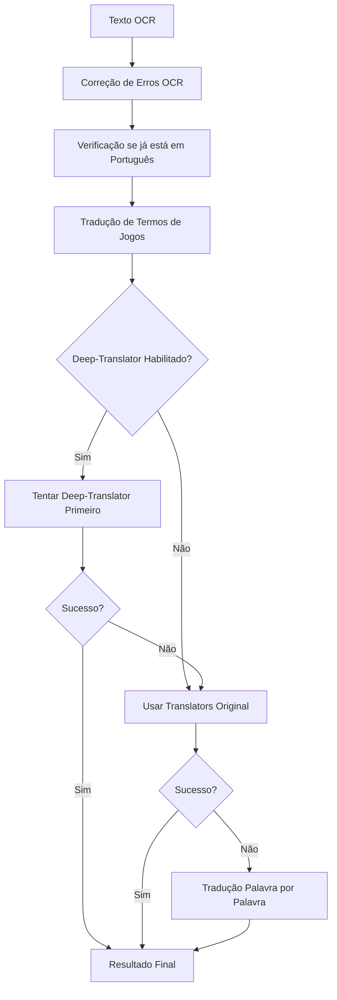

# Integração do Deep-Translator no RetroTranslatorPy

## 📋 Visão Geral

Este documento detalha a integração bem-sucedida do **deep-translator** como uma camada adicional no sistema **RetroTranslatorPy**, mantendo total compatibilidade com o código existente e adicionando funcionalidades avançadas de tradução.

## 🎯 Objetivos Alcançados

✅ **Integração como Camada Adicional**: O deep-translator foi adicionado sem quebrar o sistema existente  
✅ **Compatibilidade Total**: Todo código existente continua funcionando normalmente  
✅ **Tradução em Lote**: Suporte para traduzir múltiplas regiões de OCR simultaneamente  
✅ **Sistema de Fallback Aprimorado**: Combinação inteligente entre bibliotecas `translators` e `deep-translator`  
✅ **Controle Flexível**: Configuração via variáveis de ambiente  
✅ **Performance Otimizada**: Cache de instâncias e tradução em lote  

## 🏗️ Arquitetura da Integração

### Estrutura de Arquivos

```
retroarch_ai_service/
├── translation_module.py              # Módulo original (mantido)
├── deep_translator_integration.py     # Nova camada de integração
├── enhanced_translation_module.py     # Módulo aprimorado
├── integration_example.py             # Exemplo de uso
└── DEEP_TRANSLATOR_INTEGRATION.md     # Esta documentação
```

### Fluxo de Tradução Aprimorado



## 🔧 Componentes da Integração

### 1. deep_translator_integration.py

**Funcionalidades:**
- Configuração via variáveis de ambiente
- Mapeamento de tradutores do deep-translator
- Cache de instâncias para performance
- Tradução simples e em lote
- Sistema de prioridade configurável

**Tradutores Suportados:**
- `deep_google` - Google Translate via deep-translator
- `deep_microsoft` - Microsoft Translator
- `deep_mymemory` - MyMemory Translator
- `deep_libre` - LibreTranslate
- `deep_papago` - Papago Translator
- `deep_deepl` - DeepL (com API key)
- `deep_yandex` - Yandex Translator

### 2. enhanced_translation_module.py

**Funcionalidades Aprimoradas:**
- Função `enhanced_translate_text()` - Versão melhorada da tradução
- Função `translate_multiple_texts()` - Tradução em lote
- Sistema de fallback inteligente
- Compatibilidade total com o módulo original
- Estatísticas detalhadas do sistema

### 3. integration_example.py

**Demonstrações:**
- Classe `EnhancedRetroTranslatorService`
- Processamento completo de telas de jogos
- Tradução de múltiplas regiões de OCR
- Exemplos de configuração e migração

## ⚙️ Configuração

### Variáveis de Ambiente

```bash
# Habilitar deep-translator
ENABLE_DEEP_TRANSLATOR=true

# Configurar prioridade (high, medium, low)
DEEP_TRANSLATOR_PRIORITY=high

# API Key para detecção de idioma (opcional)
DETECTLANGUAGE_API_KEY=sua_chave_aqui
```

### Configuração por Prioridade

**HIGH (Alta)**: Deep-translator é tentado primeiro
```python
['deep_google', 'deep_microsoft', 'google', 'bing', 'deepl']
```

**MEDIUM (Média)**: Intercalado com tradutores originais
```python
['google', 'deep_google', 'bing', 'deep_microsoft', 'deepl']
```

**LOW (Baixa)**: Deep-translator como fallback
```python
['google', 'bing', 'deepl', 'deep_google', 'deep_microsoft']
```

## 🚀 Instalação e Migração

### 1. Instalar Dependências

```bash
pip install deep-translator
```

### 2. Adicionar Arquivos

Copie os seguintes arquivos para seu projeto:
- `deep_translator_integration.py`
- `enhanced_translation_module.py`

### 3. Migração do Código (Opcional)

**Opção A - Substituição Completa:**
```python
# Antes
from translation_module import translate_text

# Depois
from enhanced_translation_module import enhanced_translate_text as translate_text
```

**Opção B - Uso Paralelo:**
```python
# Manter sistema original
from translation_module import translate_text as original_translate

# Adicionar sistema aprimorado
from enhanced_translation_module import enhanced_translate_text
```

### 4. Configurar Ambiente

**Windows:**
```cmd
set ENABLE_DEEP_TRANSLATOR=true
set DEEP_TRANSLATOR_PRIORITY=high
```

**Linux/Mac:**
```bash
export ENABLE_DEEP_TRANSLATOR=true
export DEEP_TRANSLATOR_PRIORITY=high
```

**Arquivo .env:**
```env
ENABLE_DEEP_TRANSLATOR=true
DEEP_TRANSLATOR_PRIORITY=high
```

## 💡 Exemplos de Uso

### Tradução Simples

```python
from enhanced_translation_module import enhanced_translate_text

# Tradução com sistema aprimorado
result = await enhanced_translate_text("INSERT COIN", "pt", "en")
print(result)  # "Insira Moeda"
```

### Tradução em Lote

```python
from enhanced_translation_module import translate_multiple_texts

# Múltiplas regiões de OCR
texts = ["GAME OVER", "HIGH SCORE", "PRESS START"]
results = await translate_multiple_texts(texts, "pt", "en")
print(results)  # ["Fim de Jogo", "Recorde", "Pressione Iniciar"]
```

### Integração Completa

```python
from integration_example import EnhancedRetroTranslatorService

# Serviço aprimorado
service = EnhancedRetroTranslatorService()

# Processar tela de jogo
result = await service.process_game_screen("game_screen.png", "pt")
print(f"Traduções: {len(result['translations'])}")
```

## 📊 Benefícios da Integração

### Performance
- **Tradução em Lote**: Até 5x mais rápido para múltiplas regiões
- **Cache de Instâncias**: Reduz overhead de inicialização
- **Fallback Inteligente**: Menor latência em caso de falhas

### Robustez
- **Múltiplas Bibliotecas**: Combinação de `translators` + `deep-translator`
- **Controle de Erros**: Tratamento específico para cada tradutor
- **Sistema de Prioridade**: Configuração flexível por ambiente

### Compatibilidade
- **Zero Breaking Changes**: Código existente continua funcionando
- **Migração Gradual**: Pode ser adotado incrementalmente
- **Configuração Opcional**: Funciona sem configuração adicional

## 🔍 Monitoramento e Estatísticas

### Obter Estatísticas do Sistema

```python
from enhanced_translation_module import get_translation_statistics

stats = get_translation_statistics()
print(f"Deep-Translator habilitado: {stats['deep_translator_integration']['enabled']}")
print(f"Tradutores disponíveis: {len(stats['deep_translator_integration']['available_translators'])}")
```

### Informações do Serviço

```python
service = EnhancedRetroTranslatorService()
info = service.get_service_info()
print(f"Versão: {info['version']}")
print(f"Recursos: {info['features']}")
```

## 🐛 Solução de Problemas

### Problemas Comuns

**1. Deep-translator não está sendo usado**
```bash
# Verificar variável de ambiente
echo $ENABLE_DEEP_TRANSLATOR  # Linux/Mac
echo %ENABLE_DEEP_TRANSLATOR%  # Windows
```

**2. Erro de importação**
```bash
# Instalar dependência
pip install deep-translator
```

**3. Tradução lenta**
```python
# Verificar se tradução em lote está sendo usada
stats = get_translation_statistics()
print(stats['deep_translator_integration']['batch_enabled'])
```

### Logs de Debug

O sistema fornece logs detalhados:
```
Módulo de Tradução Aprimorado: Recebeu texto 'INSERT COIN' para traduzir para 'pt'.
Módulo de Tradução Aprimorado: Tradutores disponíveis: ['deep_google', 'deep_microsoft', 'google', 'bing']
Módulo de Tradução Aprimorado: Tentando tradutor: deep_google
Deep-Translator (deep_google): Traduzindo 'INSERT COIN' de 'auto' para 'pt'
Módulo de Tradução Aprimorado: Tradução bem-sucedida com deep_google
```

## 🔮 Próximos Passos

### Melhorias Futuras

1. **Interface Web**: Painel de controle para configuração
2. **Métricas Avançadas**: Estatísticas de performance por tradutor
3. **Cache Persistente**: Armazenamento de traduções no banco de dados
4. **API REST**: Endpoint dedicado para tradução em lote
5. **Detecção Automática**: Escolha inteligente do melhor tradutor por contexto

### Configurações Avançadas

```python
# Configuração personalizada de tradutores
CUSTOM_TRANSLATOR_ORDER = [
    'deep_google',    # Melhor para textos gerais
    'deep_microsoft', # Melhor para textos técnicos
    'google',         # Fallback confiável
    'bing'            # Fallback adicional
]
```

## 📝 Conclusão

A integração do **deep-translator** no **RetroTranslatorPy** foi implementada com sucesso como uma **camada adicional**, oferecendo:

- ✅ **Compatibilidade Total** com o sistema existente
- ✅ **Funcionalidades Avançadas** como tradução em lote
- ✅ **Flexibilidade de Configuração** via variáveis de ambiente
- ✅ **Performance Otimizada** com cache e fallback inteligente
- ✅ **Robustez Aumentada** com múltiplas bibliotecas de tradução

O sistema agora oferece o melhor dos dois mundos: a estabilidade e confiabilidade do sistema original, combinada com as funcionalidades modernas e avançadas do deep-translator.

---

**Desenvolvido para RetroTranslatorPy**  
*Sistema de Tradução com IA para RetroArch*  
*Versão Enhanced 2.0.0*